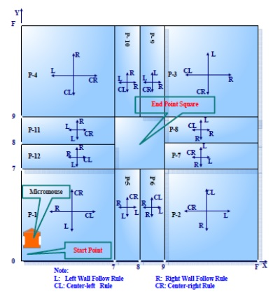
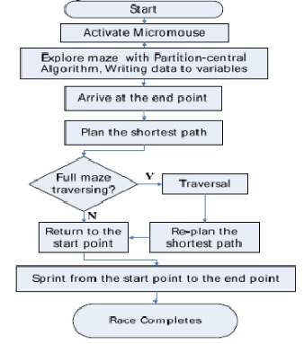
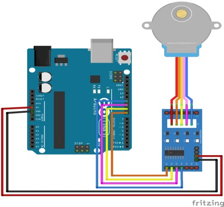
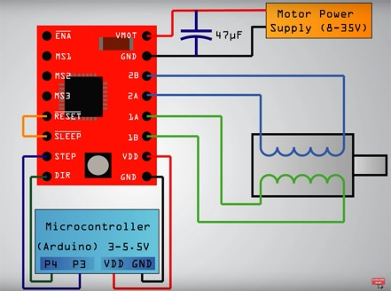
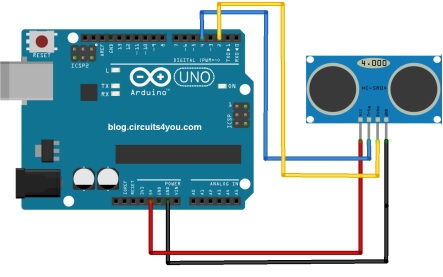
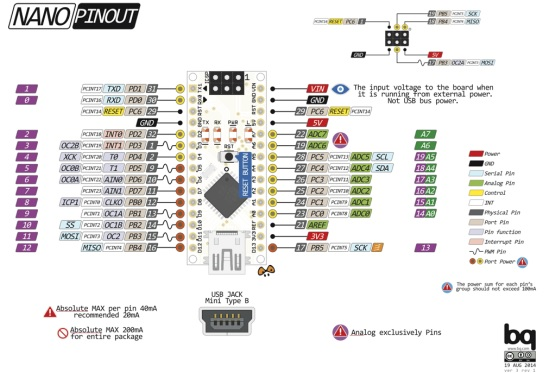

# Micro-mouse maze Challenge

## Project Idea
The idea of the project is to make a autonomous self-contained robot, which can get into the center of the maze on it’s own in the shortest possible time. 

## Constraints
The constraints in this project are:
1. Size, the size of the maze is fixed and so the dimensions of our robot must meet the specifications of the maze. The size must be in such a way that it could turn easily, rotate itself to 180 degrees. 
2. Self-contained, the robot must be autonomous and self-contained, once the challenge has started the code can’t be changed or there can’t be any remote controls. Once, the challenge is started we can’t reprogram the robot again.
3. Time, the robot should navigate to the center of the maze in the shortest possible time.

## Proposed Idea
### Size:
The dimensions of the maze is given as 16x16 square sheet with each square of dimension 18x18 cm2. So, our robot must be of a specific dimension that if must fit into the 18x18 square and be also possible to turn around, rotate at 180 degrees.In the 18x18 square 1.2 cm is wall and so the remaining space can be used for movement. So, the optimum dimension of our robot including all the sensor shall be within 10x10 cm2. The maximum height of the robot can be of 100cm, in this case we don’t have much constraint.

### Self-Contained:
To make the robot move on it’s own, we could employ few algorithms of mapping in the micro-controller, so that the robot creates a map of all the 256 squares and makes note of the walls in it. For this purpose we could use the numbers of squares from the starting point and then, note all the squares through which it traverses. In the initial run, the robot can be made to run through all the squares and then create the whole map of which all squares are connected (i.e) they make a path to the center. We use an ultrasonic sensor in the front, and time of flight on both the sides and then see the distance and have a threshold value and compare it with the actual reading and make turns. A common algorithm of either turning left or right every time shall be made. Also along-with it in the back we could use the Time of flight sensor, to trace back to the initial position.

### Time:
So, in the initial first it moves trough all the possible squares and then using the data collected and stored in the array, we can find out the shortest path and make it to the centre. The center can be detected if all the three sensors in the front side values fall behind the threshold value.

## Ideation Pipeline:

Sensors (Ultrasonic + Stepper motor’s step value) => Microcontroller => Mapping the maze (Partition Central Algorithm) => Optimization Algorithm => Motors

### Sensors:
An important step in the process of maze solving is that to find the walls, so in order, to do that we use the ultrasonic sensors. We use three ultrasonic sensors one at the front and two in the sides to map the walls. Also, the two ultrasonic sensors help us in achieving the PID Control in an easier fashion.
Also in order to track, if the bot has moved a unit square of dimension 18x18 cm2 amongst the 256 squares we use the step value of the stepper motor and the diameter of the wheel. This is one of the reasons to use the stepper motor.

### Microcontroller: 
The task of the microcontroller is to primarily to store the information regarding the maze that is being collected upon by the sensors and then implement few optimization algorithms to detect the shortest path to the target point. The information that are stored in the microcontroller must be readily accessible in order to implement the optimization algorithms. All the details of the maze at every location on the square must be noted on. Following the output generated from the optimization algorithm, the microcontroller drives the motor in the optimal speed to achieve it in a faster time. 

The data that is being stored in the microcontroller includes the following:
1. _Micromouse absolute direction marking (Dir):_ a 4-bit binary number is used to represent the micromouse absolute direction which is unrelated with the micromouse current moving direction, if Dir is set to be one of the values of 0x01, 0x02, 0x04, 0x08, the micromouse is to take the next direction of east, west, south and north direction.

2. _Wall data recording (MapBlock [x] [y]):_ A 16*16 byte array is defined to store information on the maze walls in the micromouse program. When the micromouse reaches a grid, current information of the cell walls around is recorded according to sense states of the IR sensors. Each bit is used to represent one side wall status. Value 0 means there is a wall on this side while 1 means not. Each LSB(bit3 ~ bit0) of the byte variable is used to store information of the walls in 4 directions, that is east, west, south and north wall separately. All the variable bits are initialized to 0, indicating there are walls around all units on the maze.

3. _Virtual Wall Recording (VW):_ The wall state is set to 0 when the micromouse encounters a dead end or a closed looping path during the exploring process.

4. _Times of Micromouse passes a unit (counts[x][y]) :_ All the elements value is initialize to 0. Each time when the micromouse pass certain unit, count value of this unit increases 1.

The microcontroller that is being used here must have good storage capabilities, so we can primarily use Arduino Nano(due to its small size). 
 
### Mapping cum Optimization Algorithm:

For the mapping and solving of the maze there are many algorithms such as the wall following algorithm, flood fill algorithm and etc., all these do finish up the challenge in order to boost the process or in other words to kick start and simplify those algorithms we use the partition fill algorithm method to map the maze. For this purpose the maze is being spit into 12 partitions, and then the mapping process is done separately in each of these partitions created. 
At any instance of time in the track, the micromouse has only a maximum of 3 directions to choose, i.e. the front, left and right, If a micromouse encounters multiple directions cross-way, the following rules are available for choosing:
1. Left-hand rule: take precedence to the left direction, then straight direction, finally turn right direction.
2. Right-hand rule: take precedence to the right direction, then straight direction, finally turn left direction.
3. Central-left rule: take precedence to straight, then turn left, finally turn right.
4. Central-right rule: take precedence to straight, then turn right, finally turn left.
5. Central-trend rule: the micromouse always takes precedence to the end point which is located in the 4-unit square area on the maze center.

In the traditional algorithms we choose any one of the above mentioned rule for the complete maze, but this partition-central algorithm uses the exact location of the bot(in which partition is it in) and the direction at which the bot is facing to decide upon which rue has to be applied in order to reach out to the center. If in the junction between the two partitions any closed loop forms and we keep on moving in it, then we use the other two variables namely the virtual walls(VW) and the step count. 

Following this we use the contour map generation technique to find out the distance travelled in the each possible route applicable to the center of the maze and find the shortest route based on the value in the map.

Along with this we also use other technique of diagonal filling in order to find out, if there is any single diagonal route instead of a criss-cross loop, by doing this we could be able to reduce the time taken.

### Stepper motor: (Driver [Datasheet](https://robu.in/wp-content/uploads/2015/12/pololu_a4988-1.pdf)) 

Stepper motor, as the name suggest we have the control on the step sizes of motor. Basically, those step sizes are measured in angles. By knowing the diameter of the wheel we use, we can always keep a track of how much distance the robot has moved. Also, after the computation ad optimization the output can be easily fed into them using the microcontroller. 

### Ultrasonic Sensor:
Here we use the HC-SR04 ultrasonic sensor in order to measure the distance of the wall, it has few advantages such as, it can be used in any lighting conditions since it uses sound waves also it consumes low power. Even though the accuracy is low, for short range applications it can be used. Also, it’s highly cost efficient and the connection also pretty much easier.

### Arduino Nano: 
The microcontroller that we use here is Arduino Nano, which is one of the most popular microcontroller that is widely used. In our application we use 3 ultrasonic sensors and two stepper motor drivers. Each ultrasonic sensor requires 2 digital pins and each stepper motor driver needs 4 digital pin. So a total of 14 digital pins are needed. Fortunately the number of digital pins in arduino nano is also 14, no worries also the analog pins of Arduino can be used for digital purposes too and so there is no need for the use of Uno or mega. The other advantage of using Nano is that it’s size is small and so, the whole size of the bot can be reduced. One of the important step in the micro-mouse challenge is to reduce the size of the robot.

### Power source:
The components that are used here don’t require much power and they can directly run by using a Power bank that is used for mobile charging. Basically we take two output from the power bank and give one of it to the motor driver and other to the microcontroller, so as to increase the speed of the robot. 

### Motor Control:
Here we use two steppers at the back and a castor wheel in the front. There are two stepper motor drivers that drive the motors separately and then for the movement we use PID algorithm, so as to make the bot align itself in a proper direction if any error occurs.
In the initial run,where we map, so for that the speed of the motor will be low. After the mapping in the second, the robot will just follow the path decided by the algorithm. This can be done with the help the library functions present in the stepper motor library.

### Design:
The design for it can be made on a general PCB with two motors and a castor wheel in the front. The two stepper motors are placed at the back and then arduino is placed on the chases and then the two micro controllers placed near the board itself. The Three Ultrasonic sensors are placed one at the front and two are located near the sides. The weight of each motor is around 200gm and the total weight of the bot will be around 500gm. 

## Cost Analysis:
1. Ultrasonic sensor - 3 units. (Rs.207) (https://robu.in/product/hc-sr04-ultrasonic-range-finder/)
2. Stepper motor - 2 units (Rs.1360) (https://robu.in/product/nema17-1-6kgcm-stepper-motor/https://robu.in/product/nema17-1-6kgcm-stepper-motor/)
3. Stepper motor driver - 2 units (Rs. 198) (https://robu.in/product/a4988-driver-stepper-motor-driver/)
4. Arduino Nano - 1 unit. (Rs.1428) 
(https://robu.in/product/original-arduino-nano/)

Total: Rs.1200 (approx.)

## References:
1. https://ieeexplore.ieee.org/document/5578409 - Algorithm
2. https://www.seeedstudio.com/blog/2019/12/23/distance-sensors-types-and-selection-guide/ - Distance Sensor guide
3. https://www.elprocus.com/stepper-motor-types-advantages-applications/ - Stepper motor working
